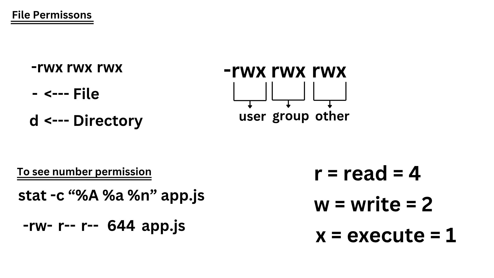

[<-- back to main](./README.md)

[<-- back to os fundamentals](./os_fundamentals.md)


## We can see environment variables
- `process.env` <---- node.js
- `environment variables` <---- windows

creating enviroment variable
```bash
export num = 58; # now num is environment variable
```

## Installing WSL
```bash
wsl --install
```
to open: `\\wsl$` in filepath

## Changing filepath
```bash
# bash to windows
cygpath -w path
```
```bash
# windows to bash
cygpath -u path
```

## File Permission



## Changing Permission

```bash
chmod -x src/ # <---- for all

chmod u-x src/ # <---- for user

g # <---- for group

o # <---- for others

chmod 777 src/ # <---- using number
```

## Git file permission

**100644**: Normal file with non-executable permission.

**100755**: Normal file with executable permission.

**120000**: Symbolic link.

**040000**: Directory

## Process properties

- `process.argv`

- `process.env`

- `process.pid`

- `process.ppid`

- `process.platform`

and more

[<-- back to os fundamentals](./os_fundamentals.md)

[<-- back to main](./README.md)