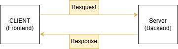

[<-- back to Topics](../README.md)

[<-- prerequisites](./prerequisites.md)

[CLI & GUI -->](./cli_gui.md)

# What is Backend & Client-Server Architecture?

## What is Backend?
- A server is a computer or system that provides resources, data, services, or programs to other computers, known as clients, over a network. Servers can be dedicated to specific tasks such as web hosting, database management, or file storage.

## What is client?

- A client is a computer or software that requests services or data from a server over a network. It interacts with the server by sending requests and receiving responses, typically through a web browser, mobile app, or other software applications.

[CLI & GUI -->](./cli_gui.md)

[<-- prerequisites](./prerequisites.md)

[<-- back to Topics](../README.md)