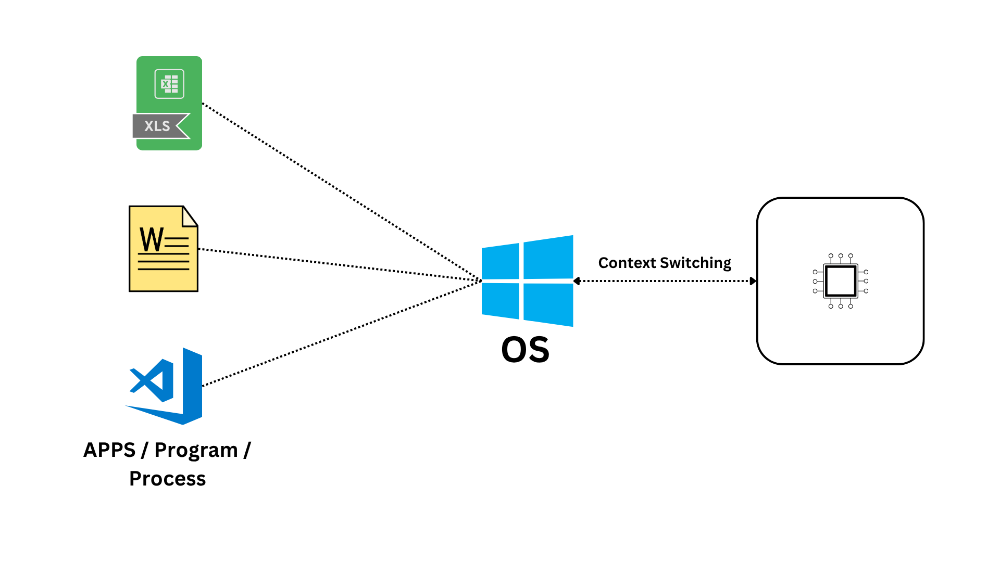
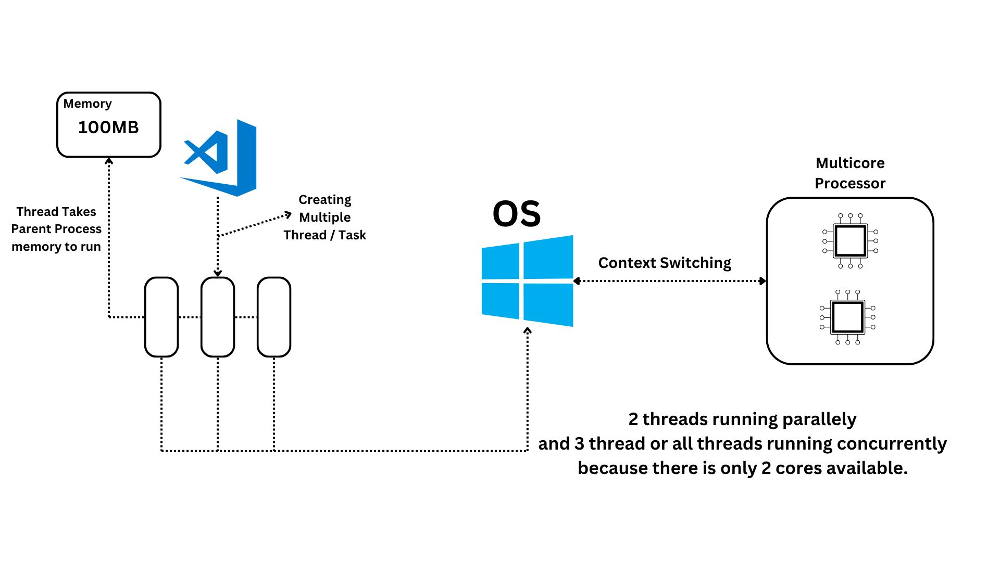

[<-- back to main](./README.md)

[<-- back to shell commands](./shell_commands.md)

[file permission -->](./file_permission.md)

## Multiple process run on single core CPU


## Watching process workflow
- Task Manager
- [Process Explorer](https://learn.microsoft.com/en-us/sysinternals/downloads/process-explorer)
- [System Informer](https://systeminformer.sourceforge.io/)

We can use to see
- PID
- PPID
- CPU Usage
- Memory Usage
- Context Switching
- Threads
- TID

## Process in node

```js
const x = process;
console.log(x);
```

## Multitasking


- **Concurrency**: Running process repetily one by one in instence.
- **Parallelism**: Running all process at a same instence.

## Starting a Process / Task
```js
for(let i = 0; i < 1000000000; i++){
    if(i % 50000000 == 0){
        console.log(i);
    }
}

// In Single loop time: 1s
// Three loop time: 3s
// CPU usage: 8.3%
// Thread: 12
```

## Multithreading
```js
const { Worker } = require("worker_threads");
new Worker("./a.js");
new Worker("./b.js");
new Worker("./c.js");

// Total time: 1s
// CPU usage: 24.2%
// Thread: 15
```

[file permission -->](./file_permission.md)

[<-- back to shell commands](./shell_commands.md)

[<-- back to main](./README.md)