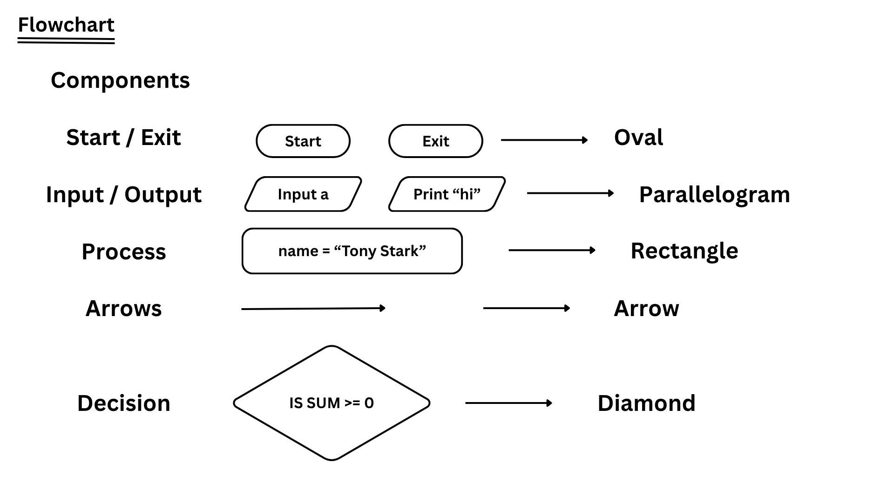

[<-- back to main](./README.md)

## Flowchart

## Components



## sum of 2 numbers


```txt
input a & b
sum = a + b
print sum
exit
```

## min of 2 numbers

;

```txt
input a & b
if a < b
    print a
else
    print b
exit
```

## sum of numbers from 1 to n


```txt
input n
count = 1, sum = 0
while count <= n
    sum = sum + count
    count = count + 1
print sum
exit
```

## is number prime or not


```txt
input n
i = 2
while i <= (n - 1)
    if n % i == 0
        print non-prime
        exit
    else
        i += 1
print prime
exit
```

[<-- back to main](./README.md)