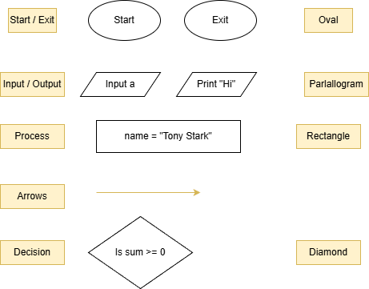
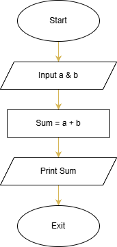
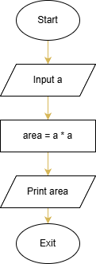

# Flowchart & Pseudocode

## Flowchart
Diagram of a solution:



## Sum of two numbers
 


## Pseudocode

```
// Pseudocode for sum of two numbers
Input a + b
sum = a + b
print sum
Exit
```

## Area of a Square



```
// Pseudocode for area of a square
Input side
area = side * side
print area
Exit
```
